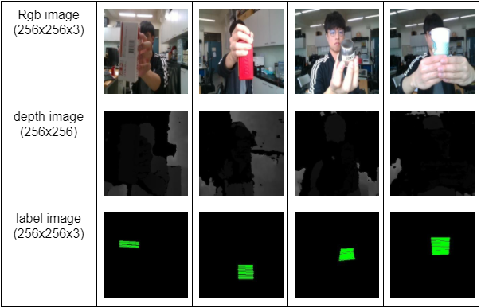

# GraspNet_Handover_Pytorch

Here is the work to use FCN model to predict a "grasp point" by Pytorch .<br>
reference : [Robotic Pick-and-Place of Novel Objects in Clutter](https://arxiv.org/pdf/1710.01330.pdf)


Two stream FCN model (backbone : ResNet101)<br>


[DATASETS](https://drive.google.com/file/d/13vRFPhruy37sk3Tzo4Z6dyw--TFWSIuH/view?usp=sharing)

# How to use

## I. Get image data from rosbags
You can collect the image by recording rosbag and get data from them . This work will generate two folder which include RGB images and Depth images .
```bash
$ python3 rosbag2img.py --bags_dir="your own path"
```

## II. Labeling and generate datasets
Our method of labeling is to label the grasping pose of parallel gripper . ( green line )


This command will create the lable images from json files . And create the training and testing list .
```bash
$ python3 data_preprocess.py --data_dir="your own path"
```
## II. Train
```bash
$ python3 train.py --data_dir="your own path"
```
